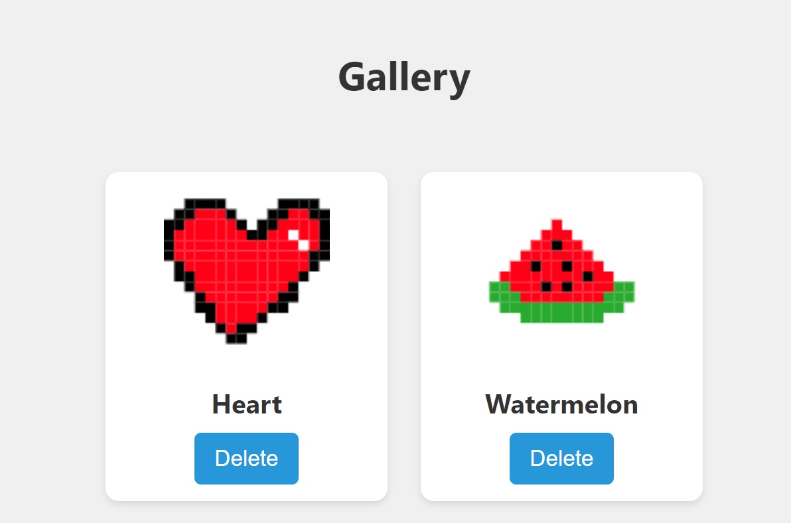
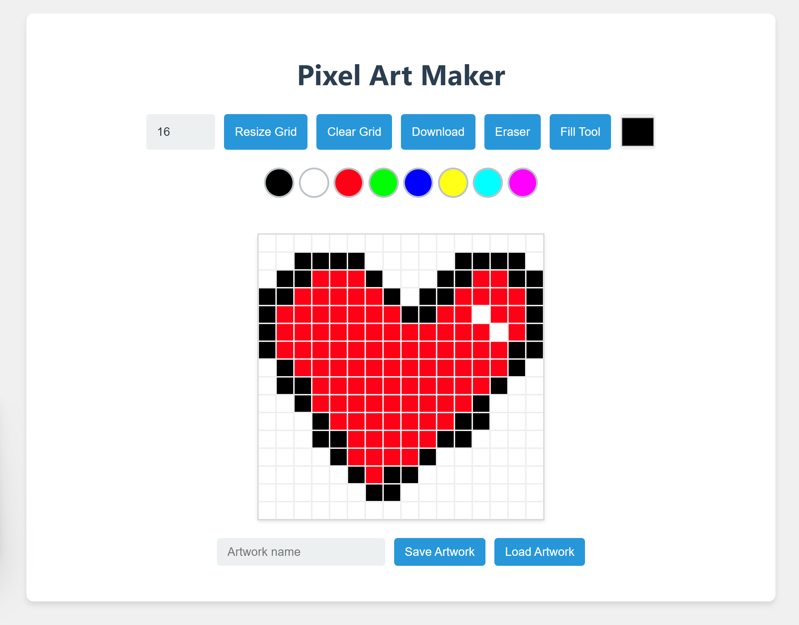
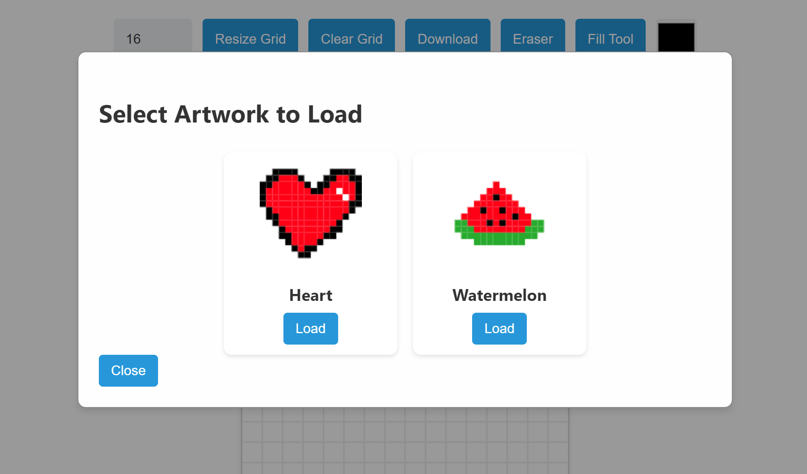

# PixelArt Maker - HTML CSS and JS
By Hayden Kong

This is a PixelArt maker built using the Canvas API in HTML/JS. To run, download and extract this repo .zip and open index.html. You can also try out the LIVE demo here: https://pixelverseit.github.io/pixelart-maker/

